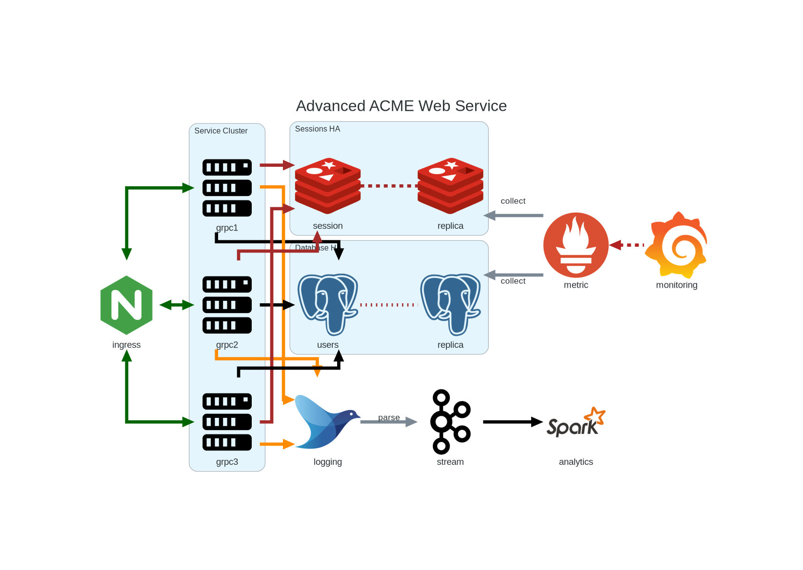

.. create pdf with "rst2pdf EU_STR.rst -s styles/str.yaml,styles/cui.yaml --use-floating-images -o EU_STD.pdf"

.. class:: title-logobox

.. list-table::
   :widths: 72

   * - |
       |
       |
       | |ACME_logo|

|
|
|
|

.. class:: title-deepbox

.. list-table::
   :widths: 72

   * - .. class:: title-name

       Software Version Description
   * - .. class:: title-name

       ACME Engineering Evaluation Unit

|
|
|

.. class:: title-info

Doc #00001043

.. class:: title-info

Version 0.1

.. class:: title-info

01/24/24

|
|
|

.. role:: redtext

.. class:: title-deepbox

.. list-table::
   :widths: 72

   * - .. class:: title-notice

        :redtext:`Example Template Text Only`

        Distribution Statement A: Approved for public release. Distribution is unlimited.

        Controlled by: Department of Good Works, Security and Inspection Division, 800-NOT-REAL.

.. contents:: Table of Contents

.. raw:: pdf

   PageBreak

Revisions
=========

Document revision history.

.. list-table::
   :widths: 9 19 11 33
   :header-rows: 1

   * - Revision
     - Author
     - Date
     - Description
   * - 0.1
     - SLA
     - 2024-01-24
     - Initial draft shell
   * - 0.2
     - SLA
     - 2024-06-15
     - Add example CUI marks and distribution statement

.. raw:: pdf

   PageBreak

1.0 - Scope
===========

1.1 - Identification
####################

This document is the Draft Software Version Description (see revision table)
for the End-user Management Component of the Advanced ACME Web Services Appliance,
Engineering Evaluation Unit.

1.2 - System Overview
#####################

The Advanced ACME Web Services Appliance is an on-premise virtual Web Services
cluster with an advanced management interface.  This document provides both the
Version Description and Installation steps for the Management Console only. The
ACME Web Service high-level system components are shown in Figure 1 below:

   Figure 1. Advanced ACME Web Service Components

The management console consumes monitoring data and summarizes/displays the
analytics from Spark.

1.3 - Document Overview
#######################

2.0 Referenced documents
========================

3.0 Test preparations
=====================

This section shall be divided into the following paragraphs. Safety
precautions, marked by WARNING or CAUTION, and security and privacy considerations shall
be included as applicable.

3.x (Project-unique identifier of a test)
#########################################

Appendix A. Acronyms and abbreviations
======================================

The following may be used in this document to describe specific technologies
or engineering processes.

:AES: Advanced Encryption Standard - algorithm for symmetric key encryption/decryption
:BIF: Boot Image Format
:CI/CD: Continuous Integration/Continuous Deployment
:CONOPS: Concept of Operations
:COTS: Commercial-Off-The-Shelf
:CSCI: Computer Software Configuration Item
:DT&E: Developmental Test and Evaluation
:FPGA: Field-programmable gate array
:FSBL: First-stage boot loader
:FW: Firmware
:HMAC: Hashed Message Authentication Code - algorithm for private key authentication
:HW: Hardware
:ID: Project-unique identifier
:IRS: Interface Requirements Specification
:ICD: Interface Control Document (should reference IRS docs)
:JTAG: Joint Test Action Group debugging interface
:KPP: Key Performance Parameter
:KSA: Key System Attribute
:LRU: Line-Replaceable Unit
:MOE: Measure of Effectiveness
:MOP: Measure of Performance
:MS: Milestone
:NVM: Nonvolatile Memory
:O&M: Operations and Maintenance
:OCM: On-chip memory
:OT&E: Operational Test and Evaluation
:PL: Programmable Logic - FPGA plus FW
:POR: Power On / Reset
:PS: Processing System - ARMv7 Linux runtime
:PR: Pull Request (agile code review/quality check workflow step)
:R&R: Remove and Replace
:RAM: Reliability, Availability, and Maintainability (aka RMA)
:RC: Release Candidate (SW and FW)
:SS/SRS: System/Subsystem/Software Requirements Specifications
:SS/SDD: System/Subsystem/Software Design Descriptions
:SDP: Software Development Plan
:STP: Software Test Plan
:STR: Software Test Description
:STR: Software Test Report
:SUT: System Under Test
:SW: Software
:T&E: Test and Evaluation
:TDP: Technical Data Package
:VMP: Vulnerability Management Process
